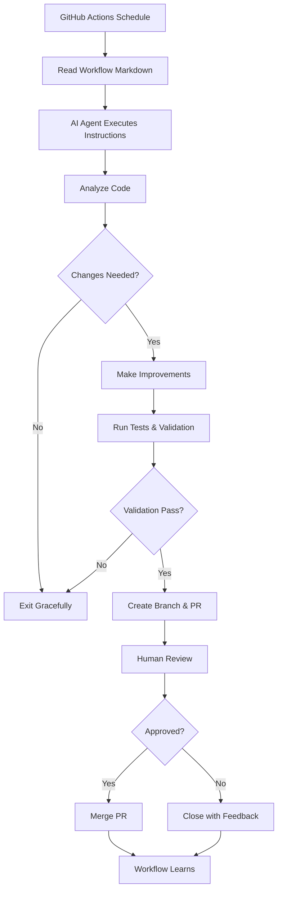

# Pull Request Summary: GitHub Agentic Workflows Implementation

## Overview

This PR implements **GitHub Agentic Workflows** for the Y-Not Radio site, adopting the automation approach described in the [GitHub blog post](https://github.blog/ai-and-ml/automate-repository-tasks-with-github-agentic-workflows/).

These workflows provide continuous automated assistance for:
- ✅ **Code refactoring** - Strategic structural improvements
- ✅ **Code simplification** - Daily cleanup and quality improvements  
- ✅ **Test coverage** - Systematic test additions toward 80% goal

## What Changed

### Files Added (3,200+ lines)

#### Workflow Definitions (`.github/agents/`)
- **`code-simplifier.md`** (324 lines) - Daily code quality improvements
- **`test-coverage-improver.md`** (729 lines) - Systematic test coverage increases
- **`code-refactoring.md`** (624 lines) - Weekly strategic refactoring
- **`README.md`** (531 lines) - Comprehensive workflow documentation

#### Documentation (`docs/`)
- **`AGENTIC_WORKFLOWS.md`** (527 lines) - Quick start guide
- **`AGENTIC_WORKFLOWS_SUMMARY.md`** (451 lines) - Implementation summary

#### Updates
- **`AGENTS.md`** (+14 lines) - Added agentic workflows section

## How It Works

### Workflow Execution Flow



### Workflow Schedules

| Workflow | Frequency | Trigger Time |
|----------|-----------|--------------|
| Code Simplifier | Daily | 2 AM UTC |
| Test Coverage Improver | Daily | 3 AM UTC |
| Code Refactoring | Weekly | Monday 4 AM UTC |

All workflows also support manual triggering via `workflow_dispatch`.

## Key Features

### 1. Code Simplifier

**Purpose**: Automatically clean up recently modified code

**Process**:
1. Finds code merged in last 24 hours
2. Analyzes for simplification opportunities:
   - Reduces complexity
   - Removes dead code
   - Improves naming
   - Extracts inline styles to CSS
   - Applies project conventions
3. Validates changes (test, lint, build)
4. Creates PR with improvements

**Example PR Title**: `[code-simplifier] Simplify code for improved clarity`

**Impact**: Continuous code quality improvement as code is written

---

### 2. Test Coverage Improver

**Purpose**: Systematically increase test coverage to 80%

**Process** (3 phases):

**Phase 1 - Research**:
- Analyzes current coverage (~70% statements, ~55% branches)
- Identifies gaps and opportunities
- Creates discussion with improvement plan

**Phase 2 - Configuration**:
- Sets up coverage generation pipeline
- Creates GitHub Action for coverage steps
- Tests and validates pipeline

**Phase 3 - Implementation**:
- Selects one under-tested area per run
- Writes comprehensive tests
- Creates story files for components
- Opens PR with improvements
- Tracks progress in discussion

**Example PR Title**: `[test-coverage-improver] Add tests for CustomDashboard`

**Impact**: Incremental progress toward 80% coverage target

---

### 3. Code Refactoring Assistant

**Purpose**: Implement strategic refactoring from REFACTOR_CHECKLIST.md

**Process**:
1. Reviews refactoring priorities in checklist
2. Finds components over 300 lines
3. Identifies technical debt items
4. Selects one tractable refactoring target
5. Implements improvements:
   - Splits large components
   - Extracts hooks and utilities
   - Adds missing test/story files
   - Improves code organization
6. Validates thoroughly
7. Creates PR and updates checklist

**Example PR Title**: `[refactoring] Split ShowClonerClient into smaller components`

**Impact**: Systematic reduction of technical debt

## Safety & Control

### Built-in Safety Features

✅ **No Direct Commits** - Workflows can only create PRs, never push to main  
✅ **Validation Required** - Tests, linting, and builds must pass  
✅ **Sandboxed Execution** - Runs in isolated containers  
✅ **Human Approval** - All changes require review before merge  
✅ **Auto-Expiration** - PRs auto-close if not merged (Code Simplifier: 7 days)  
✅ **Audit Trail** - All actions logged in PR descriptions

### Human Control Points

- Review and approve/reject all PRs
- Request changes if needed
- Close inappropriate PRs with feedback
- Provide guidance through comments
- Disable workflows anytime
- Customize workflow behavior

### Permissions Model

```yaml
permissions:
  contents: write       # Create branches only
  issues: read          # Read context
  pull-requests: write  # Create PRs
  discussions: write    # Planning discussions (Test Coverage only)
```

Cannot:
- ❌ Push directly to main
- ❌ Merge PRs automatically
- ❌ Modify workflow files
- ❌ Change repository settings

## Activation Instructions

### Prerequisites

1. **GitHub CLI with Agentic Workflows extension**:
   ```bash
   gh extension install github/gh-aw
   ```

2. **Repository access**:
   ```bash
   gh auth login
   ```

### Activation Steps

```bash
# 1. Add workflows
gh aw add .github/agents/code-simplifier.md
gh aw add .github/agents/test-coverage-improver.md
gh aw add .github/agents/code-refactoring.md

# 2. Compile workflows (generates .github/workflows/*.yml)
gh aw compile

# 3. Commit and push
git add .github/workflows/
git commit -m "chore: activate agentic workflows"
git push

# 4. Verify
gh workflow list
```

### First Run

**Option A - Wait for schedule** (recommended)
- Workflows run automatically on their schedules
- Observe first PRs and provide feedback

**Option B - Manual trigger** (for testing)
```bash
gh workflow run code-simplifier.yml
gh workflow run test-coverage-improver.yml
gh workflow run code-refactoring.yml
```

## Expected Impact

### Immediate (1-2 weeks)
- ✅ First code simplification PRs
- ✅ Test coverage research and planning
- ✅ Initial improvements merged

### Short Term (1-3 months)
- ✅ Daily code simplifications
- ✅ Test coverage increases 5-10%
- ✅ First refactoring PRs
- ✅ Team learns workflow patterns

### Long Term (3-6 months)
- ✅ Code consistently cleaned up after changes
- ✅ Test coverage reaches 80% target
- ✅ Major refactoring items completed
- ✅ Technical debt significantly reduced

## Success Metrics

### Code Quality Improvements
- Lines of code reduced
- Cyclomatic complexity decreased
- Dead code eliminated
- Inline styles extracted to CSS

### Test Coverage Growth
- Current: ~70% statements, ~55% branches
- Target: 80% statements, 60%+ branches
- Components with tests: Increasing
- Components with stories: Increasing

### Technical Debt Reduction
- Components over 300 lines: Decreasing
- REFACTOR_CHECKLIST items: Completing
- TODO/FIXME comments: Decreasing
- Duplicate code: Decreasing

## Documentation

### Quick Reference
- **Quick Start**: [`docs/AGENTIC_WORKFLOWS.md`](docs/AGENTIC_WORKFLOWS.md)
- **Implementation Summary**: [`docs/AGENTIC_WORKFLOWS_SUMMARY.md`](docs/AGENTIC_WORKFLOWS_SUMMARY.md)
- **Detailed Guide**: [`.github/agents/README.md`](.github/agents/README.md)
- **Agent Guidelines**: [`AGENTS.md`](AGENTS.md)

### Workflow Files
- **Code Simplifier**: [`.github/agents/code-simplifier.md`](.github/agents/code-simplifier.md)
- **Test Coverage Improver**: [`.github/agents/test-coverage-improver.md`](.github/agents/test-coverage-improver.md)
- **Code Refactoring**: [`.github/agents/code-refactoring.md`](.github/agents/code-refactoring.md)

## Customization

All workflows are fully customizable:

1. **Edit workflow Markdown files** in `.github/agents/`
2. **Recompile**: `gh aw compile`
3. **Commit changes**: `git add .github/ && git commit -m "chore: customize workflows"`
4. **Push**: `git push`

Common customizations:
- Adjust schedules (change cron expressions)
- Modify validation requirements
- Change PR expiration times
- Add project-specific patterns
- Include additional checks

## Monitoring & Control

### Check Status
```bash
# List all workflow runs
gh run list

# View specific workflow runs
gh run list --workflow=code-simplifier.yml

# View logs
gh run view <run-id> --log
```

### Enable/Disable
```bash
# Disable temporarily
gh workflow disable code-simplifier.yml

# Re-enable when ready
gh workflow enable code-simplifier.yml
```

### GitHub UI
1. **Actions** tab → View all runs
2. Select workflow → See history
3. Click run → View details/logs

## FAQ

**Q: Will workflows break my code?**  
A: No. All changes require PR review and CI must pass before merge.

**Q: How much does this cost?**  
A: Uses GitHub Actions minutes. ~10 min/run. Free tier includes 2,000 min/month.

**Q: Can I customize workflows?**  
A: Yes! Edit `.github/agents/*.md` files and recompile.

**Q: What if I don't want a workflow?**  
A: Disable it: `gh workflow disable <workflow-name>.yml`

**Q: Do I need GitHub Copilot?**  
A: No. Workflows use the GitHub Agentic Workflows framework which supports various AI providers.

## Testing Plan

### Pre-Activation Testing
- [x] Workflow definitions are valid Markdown with YAML front matter
- [x] Instructions are clear and comprehensive
- [x] Project-specific patterns documented
- [x] Safety features configured
- [x] Documentation complete

### Post-Activation Testing
- [ ] Install gh-aw extension
- [ ] Add and compile workflows
- [ ] Manually trigger first runs
- [ ] Review first PRs
- [ ] Verify CI integration
- [ ] Test enable/disable functionality

### Validation Criteria
- [ ] Workflows run on schedule
- [ ] PRs created successfully
- [ ] Tests pass on PRs
- [ ] Linting passes
- [ ] PRs follow conventions
- [ ] Documentation accurate

## Comparison: Before vs After

### Before (Manual Process)
- ❌ Code quality improvements are ad-hoc
- ❌ Test coverage growth is slow and inconsistent
- ❌ Refactoring happens during crunch times
- ❌ Technical debt accumulates faster than it's paid down
- ❌ Code reviews focus on functionality, miss quality issues

### After (With Agentic Workflows)
- ✅ Code quality improves continuously and automatically
- ✅ Test coverage increases systematically toward 80% goal
- ✅ Refactoring happens regularly on a schedule
- ✅ Technical debt is paid down incrementally
- ✅ Code reviews focus on architecture, quality is automated

## Alignment with Problem Statement

> Think we should be adopting anything like this?
> https://github.blog/ai-and-ml/automate-repository-tasks-with-github-agentic-workflows/
> 
> Specifically for code refactoring, simplification, and test coverage

✅ **Adopted GitHub Agentic Workflows**  
✅ **Implemented Code Refactoring workflow** - Weekly strategic improvements  
✅ **Implemented Code Simplification workflow** - Daily continuous cleanup  
✅ **Implemented Test Coverage workflow** - Systematic test additions  

This PR fully addresses the problem statement by implementing production-ready agentic workflows tailored to the Y-Not Radio site's specific needs and conventions.

## Recommendations

### For First Month
1. **Start with Code Simplifier only** - Get familiar with one workflow
2. **Review PRs within 24 hours** - Help workflow learn quickly
3. **Provide specific feedback** - Improve workflow behavior
4. **Monitor Actions tab daily** - Catch issues early

### For Ongoing Use
1. **Enable all three workflows** - Full automation coverage
2. **Merge good PRs promptly** - Keep workflow motivated
3. **Close bad PRs with feedback** - Teach what to avoid
4. **Customize as needed** - Adapt to team preferences
5. **Track metrics monthly** - Measure impact

## Next Steps

1. **Merge this PR** - Add workflow definitions to repository
2. **Install gh-aw** - Set up extension locally
3. **Activate workflows** - Follow activation instructions
4. **Observe first runs** - Monitor and provide feedback
5. **Iterate** - Customize based on experience

---

**Ready to improve code quality automatically?** Merge this PR and follow the activation instructions in [`docs/AGENTIC_WORKFLOWS_SUMMARY.md`](docs/AGENTIC_WORKFLOWS_SUMMARY.md)!
